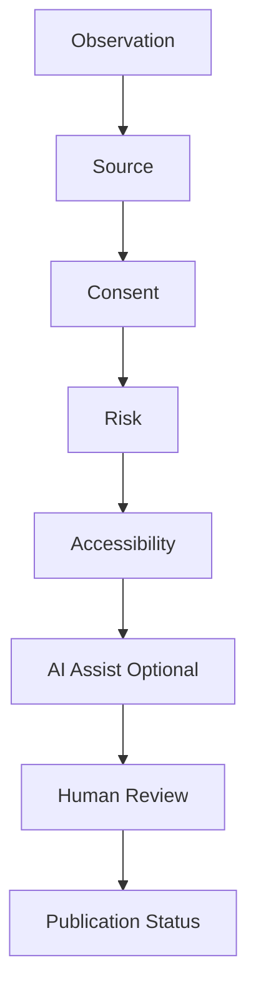

# Governance Pipeline

## Per-Step Rules

- **Source** — SSL-002, Provenance Required. See `governance/rule-library.md`.
- **Consent** — SSL-003, Consent State Required. See `governance/consent-model.md`.
- **Risk** — SSL-008, Risk Before Reach. See `governance/rule-library.md`.
- **Accessibility** — SSL-004, Accessibility Required. See `governance/rule-library.md`.
- **AI Assist (Optional)** — governed by `governance/ai-permissions.md` (SSL-005).
- **Human Review** — SSL-006, Human Publication. See `governance/rule-library.md`.
- **Publication Status** — see `governance/publication-status.md`.

## Source

Verbatim diagram from `DIAGRAMS.md`, rule mapping synthesized from `GOVERNANCE_CORE.md`, in the packet delivered by Kemi on 2026-06-26.
