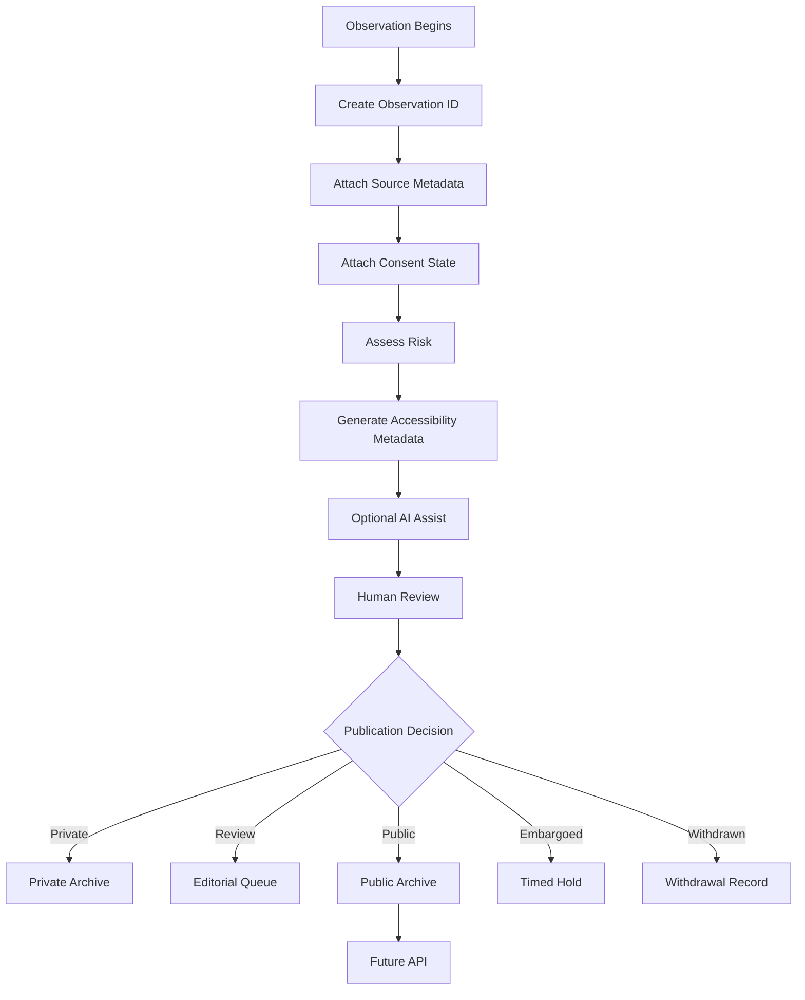

# Observation Pipeline

The MVP Loop — the path a single observation takes from capture to publication:

This is the same loop described in `docs/mvp-plan.md`. For the governance rules that gate each step, see `architecture/governance-pipeline.md`. For the underlying capture-to-archive lifecycle, see `architecture/data-lifecycle.md`.

## Source

Verbatim from `MVP_ARCHITECTURE.md` in the packet delivered by Kemi on 2026-06-26.
