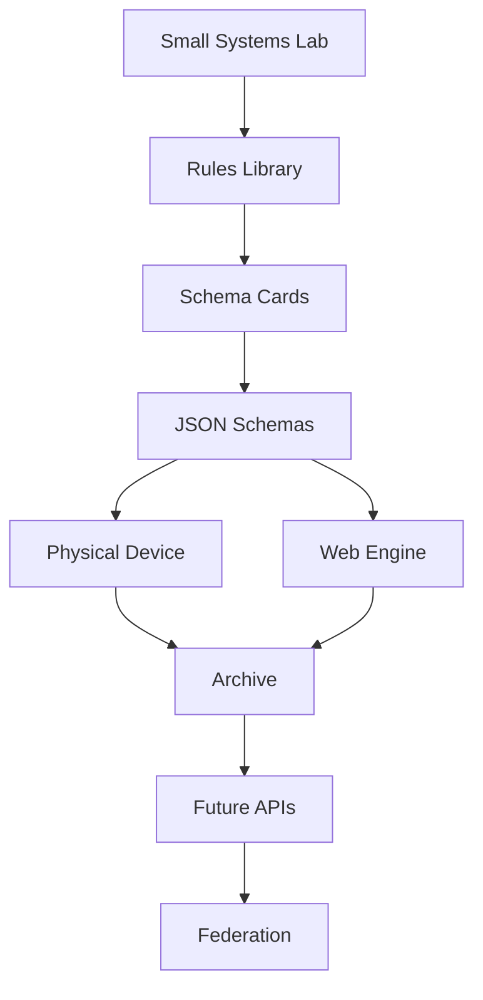

# System Overview



## Layers

```text
Small Systems Lab
  ↓
Rules Library
  ↓
Schema Cards
  ↓
JSON Schemas
  ↓
Device Capture
  ↓
Web Engine Review
  ↓
Archive
  ↓
API / Federation
```

## Source

Verbatim from `DIAGRAMS.md` and `MVP_ARCHITECTURE.md` in the packet delivered by Kemi on 2026-06-26.
