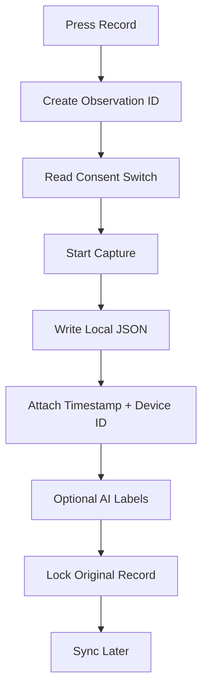

# Firmware Plan

## Device Workflow

This workflow writes structured local JSON consistent with `schemas/observation.schema.json`, `schemas/consent.schema.json`, and `schemas/source.schema.json` — not an undifferentiated media file — even before any network sync is available (SSL-009, Local First). See `research/design-decisions/ADR-0003-device-as-observation-instrument.md`.

## Research Still Needed

- battery system
- weather-resistant enclosure
- audio quality module
- GPS privacy controls
- local speech-to-text feasibility
- offline translation feasibility
- storage encryption
- haptic patterns
- blind user physical workflow
- ruggedization
- repairability

## Source

Verbatim from `DEVICE_MVP_PLAN.md` in the packet delivered by Kemi on 2026-06-26.
