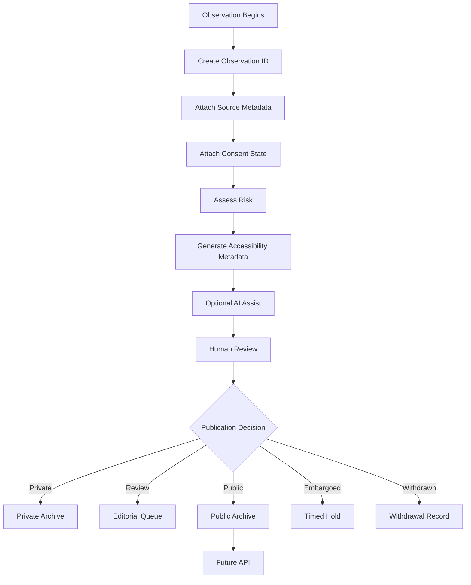

# MVP Plan

## Core Principle

AI assists. Rules govern. Humans publish.

## MVP Principle

The MVP is not a finished device or finished web engine. The MVP is a working governance loop:

Observation → Consent → Source → Risk → Accessibility → Human Review → Publication Status → Archive → API-ready record

## MVP Loop



## System Layers

```text
Small Systems Lab
  ↓
Rules Library
  ↓
Schema Cards
  ↓
JSON Schemas
  ↓
Device Capture
  ↓
Web Engine Review
  ↓
Archive
  ↓
API / Federation
```

## Software Stack

- Markdown for human-readable rules and cards
- JSON Schema for machine-readable validation
- TypeScript for the web engine
- Astro or Next.js for public documentation + app shell
- SQLite initially; Postgres later
- p5.js for visual/system diagrams and schema visualization
- ml5.js for browser-based prototype AI experiments
- OpenAPI for future API documentation

## Hardware Stack

- Arduino UNO Q 2GB as primary edge AI / real-time hybrid device brain
- Arduino Nicla Vision as compact camera/audio/sensor companion
- Arduino Nano 33 BLE Sense Rev2 as workshop/education board

## First MVP Output

A field observation package:

```text
observation-id/
  observation.json
  consent.json
  source.json
  risk.json
  accessibility.json
  media/
    audio.wav
    image.jpg
  logs/
    device-log.json
    ai-assist-log.json
    human-review-log.json
```

## Source

Synthesizes `MVP_ARCHITECTURE.md` from the packet delivered by Kemi on 2026-06-26.
