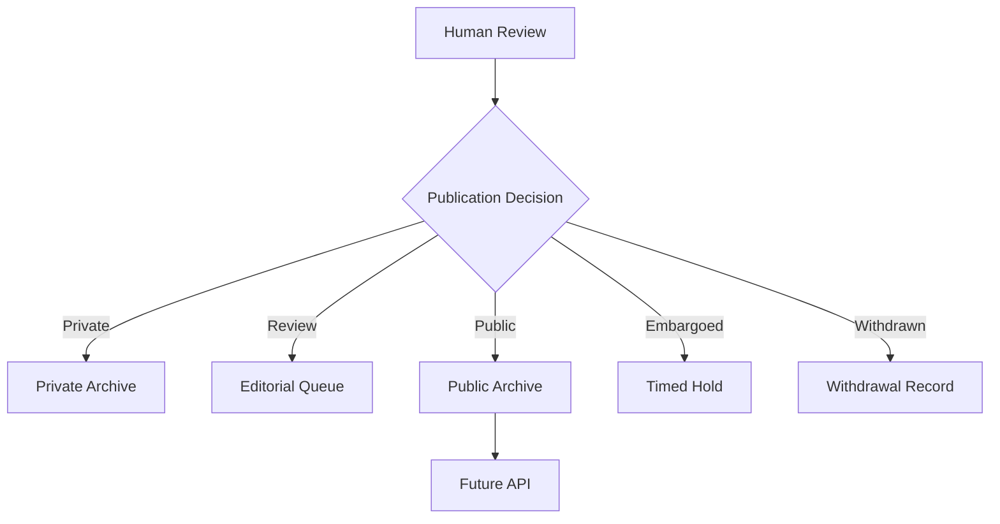

# Publication Status

## States

- **private** — not shared beyond the original observer/reviewer
- **internal_review** — in the editorial queue, not yet public
- **public** — published to the public archive
- **embargoed** — held under a timed hold before scheduled release
- **withdrawn** — previously public or queued, now withdrawn; the withdrawal itself is a record, not an erasure

## Decision Flow

## Governing Rule

SSL-006 — Human Publication: A human must approve public release.

## Relationship to Consent

Publication status is a separate, later field from consent (`schemas/consent.schema.json`). Consent is set near capture time and constrains which publication statuses are reachable; publication status is decided afterward by human editorial review. See the constraint table in `governance/consent-model.md` and the full reasoning in ADR-0004 (`research/design-decisions/ADR-0004-consent-and-publication-status-are-distinct.md`).

## Evidence States (Public-Facing Labels)

The public site and `ukadike/ukadike` README describe eight "evidence states" — plain-language labels shown to readers. These are not a sixth schema field. They are derived, non-mutually-exclusive presentation labels computed from combinations of existing fields (consent, source, risk, accessibility, publication_status). This mapping documents intent; the derivation logic is not yet implemented.

| Evidence state | Derived from |
|---|---|
| Human observed | Source record shows a human observer, or `ai_assist.enabled` is false |
| Machine suggested | `ai_assist.enabled` is true and `human_verified` is false |
| Context missing | Required source fields are incomplete |
| Consent unclear | Consent record missing, or consent state pending a decision |
| Protected uncertainty | `risk_level` is moderate or high, held pending more context |
| Unsafe to publish | `risk_level` is severe, or a blocking risk factor is present |
| Ready for review | All required records present and `publication_status` is `internal_review` |
| Withheld | `publication_status` is `private` or `withdrawn` |

A single observation can carry more than one of these labels at once (e.g., "Machine suggested" and "Ready for review").

## Source

Synthesizes the MVP Loop in `MVP_ARCHITECTURE.md` from the packet delivered by Kemi on 2026-06-26. Relationship to consent resolved per ADR-0004, 2026-06-26.
