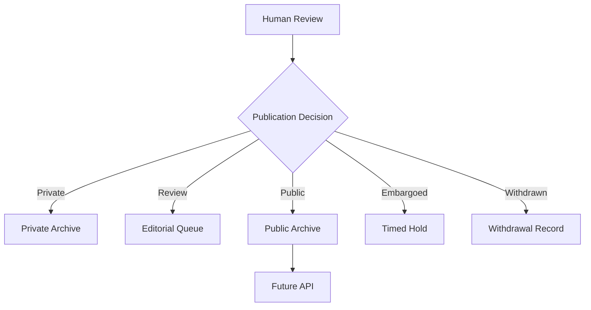

# Publication Status

## States

- **private** — not shared beyond the original observer/reviewer
- **internal_review** — in the editorial queue, not yet public
- **public** — published to the public archive
- **embargoed** — held under a timed hold before scheduled release
- **withdrawn** — previously public or queued, now withdrawn; the withdrawal itself is a record, not an erasure

## Decision Flow

## Governing Rule

SSL-006 — Human Publication: A human must approve public release.

## Note

This is the schema-level publication status model (five states). The physical device's planned consent switch currently models three states (`private` / `consented` / `review-public`). These models are related but not identical — see `governance/consent-model.md` for the open reconciliation question.

## Source

Synthesizes the MVP Loop in `MVP_ARCHITECTURE.md` from the packet delivered by Kemi on 2026-06-26.
