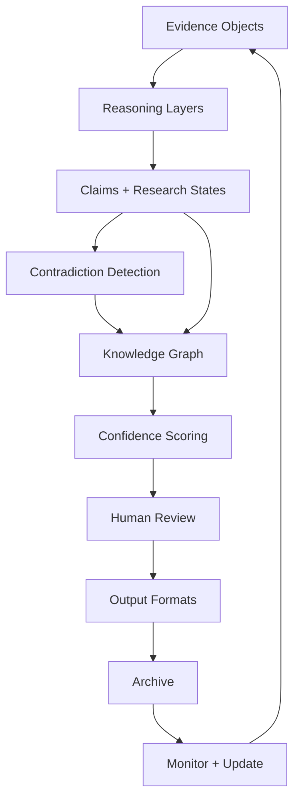

# System Overview



## Layers

```text
Evidence (schemas/evidence-object.schema.json)
  ↓
Reasoning Layers (architecture/reasoning-layers.md)
  ↓
Claims + Research States (architecture/research-states.md)
  ↓
Contradiction Detection (schemas/contradiction.schema.json)
  ↓
Knowledge Graph (architecture/knowledge-graph.md)
  ↓
Confidence Scoring (schemas/confidence-score.schema.json)
  ↓
Human Review (governance/human-governance.md)
  ↓
Output Formats (docs/output-formats.md)
  ↓
Archive → Monitor → Update → Repeat (architecture/workflow.md)
```

## Relationship to the Root Governance Loop

The root governance loop (`README.md`) is: Observation → Consent → Source → Risk →
Accessibility → Human Review → Publication Status → Archive → API-ready record.

The Investigation Engine's loop operates one layer above it: it takes one or more
already-governed Observations (or externally sourced evidence, still carrying a
`source.schema.json` record) and reasons over them to produce Claims, which then
re-enter the same root governance loop before anything is published. A Claim is not
exempt from Human Review or Publication Status just because it passed through
reasoning layers — reasoning increases what a human reviewer can see, it never
substitutes for their decision (see `governance/human-governance.md`).

## Status

Diagram and layer sequencing above are the design. No component in this diagram is
implemented as running code; see each file's own status notes and root `ROADMAP.md`.
