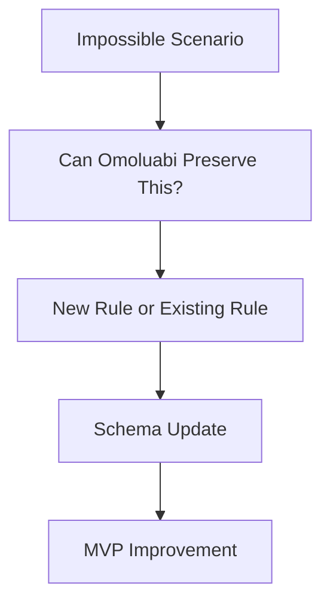

# UMADA Stress Tests

## Flow



## Scenario List

- civilization collapse
- lost archives
- extinct languages
- nonhuman testimony
- telepathic communication
- hybrid species
- propaganda
- centuries of historical drift
- alien artifacts
- inaccessible interfaces

## Worked Example

```text
UMADA question: Can Omoluabi archive telepathic testimony?
Practical question: How does Omoluabi document nonverbal, embodied, or assisted communication today?
Schema implication: Expand Observation Card to include communication mode and translation confidence.
```

None of the other nine scenarios have worked examples yet. They are listed as open stress tests, not yet run through the method above.

## Source

Verbatim Mermaid diagram ("UMADA Stress Test") from `12_diagrams/DIAGRAMS.md`; scenario list and worked example verbatim from `15_umada_sandbox/UMADA_SANDBOX.md`.