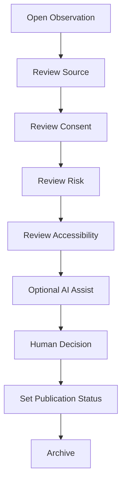

# Web Engine Architecture

## Stack

- Local-first web app
- p5.js / ml5.js for prototyping and lightweight ML-assisted experiments
- Structured JSON records validated against `schemas/`
- Human review interface over the governance pipeline

## MVP User Flow

## Status

Architecture is a first-pass MVP description. Framework choice, hosting, and sync transport are not yet decided for production.

`app/` runs this exact MVP User Flow today as a prototype: plain HTML/CSS/ES modules (no framework), served statically, storing records in browser IndexedDB (no hosting or sync — see `local-first-plan.md`). That is a prototyping choice, not the production framework decision this section still leaves open.

## Source

Verbatim diagram and stack list from `09_web_engine/WEB_ENGINE_MVP.md`.